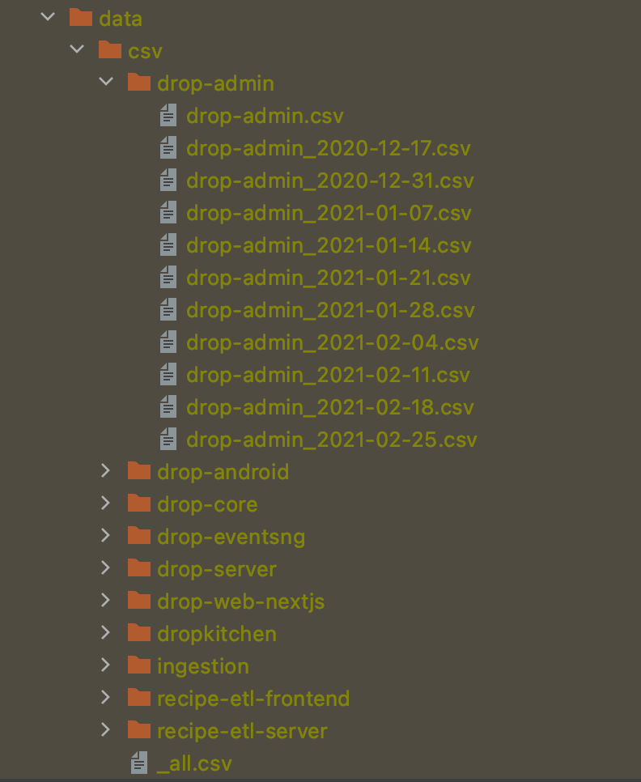
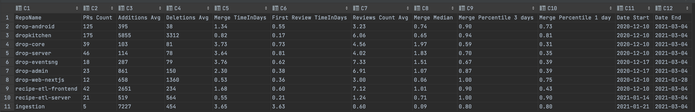
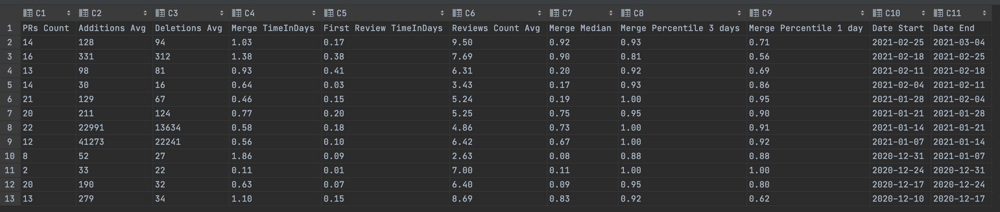

# Drop Github Metrics
Is a tool to retrieve data from Github for our repository and retrieve aggregated data on pull requests.

## Setup & run
1. Add a line in `gradle.properties` with a valid github access token with the permissions to read the repositories data
```
githubAccessToken=1234567890asdfgh
```
2. Set the list of repositories to scan in `gradle.properties`
3. run `./gradlew runDefault`
4. the data will be generated in the folder `data`

## Metrics generated
There are three levels of data collected or aggregated:


### Overview 
`_all.csv` contains all the aggregated data, over the entire period of observation, 11 weeks, per repository

   
### Repository 
In each repository folder, `repository_name.csv` contains the aggregated data per week


### Pull Request in a week
In each repository folder, `repository_name_week.csv` contains the raw data point with stats of the specific pull request

## Metrics explained
### Time measurement
All the times are expressed in days, 24h, so 0.5 means 12 hours. Every time measurement has already been cleaned by weekends, but night hours are still present
